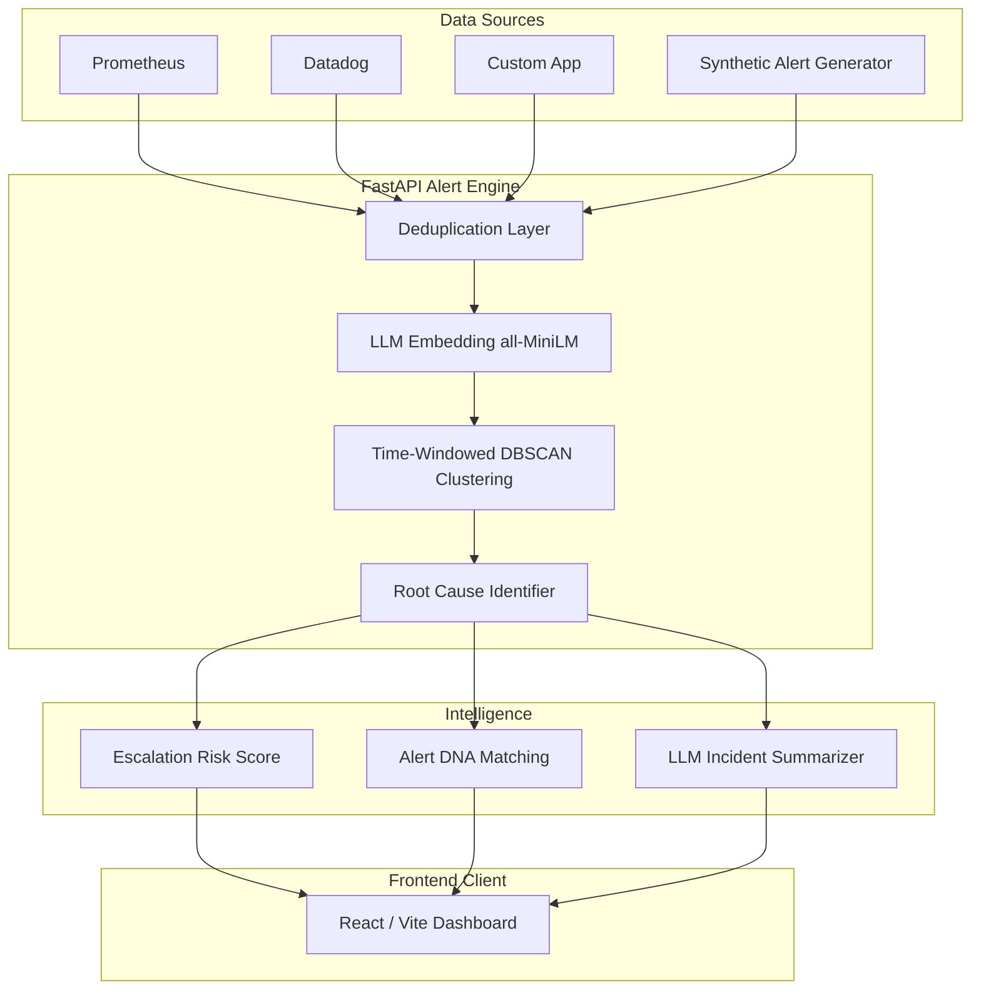

<div align="center">
  <h1>🚨 Alert Correlation & Dedup Engine</h1>
  <p><strong>Synergy 2026 · HPE Problem Statement #10</strong></p>
  <p>Turning infrastructure noise into actionable, prioritized intelligence.</p>
</div>

<br />

## 🌩️ The Problem: Alert Storms
In modern microservice architectures, **one single infrastructure failure triggers hundreds of downstream alerts within minutes.** 

Engineers spend the critical first 15 minutes of a major incident simply sifting through the noise, trying to figure out what actually broke. Existing systems rely on static rules that are hard to maintain and fail when novel incidents occur.

## 💡 The Solution: Intelligent Alert Correlation
This engine doesn't just silence alerts; it collapses the flood into a handful of **actionable incidents**. We go two steps further than traditional correlation tools:

1. 📈 **Escalation Risk Score:** A real-time, explainable signal identifying which incident cluster is trending toward a larger failure based on alert growth rate, severity trend, and service spread. Correlation tells you what broke; this tells you what to look at *first*.
2. 🧬 **Alert DNA:** Every new incident cluster is fingerprint-matched against a library of past incidents. If it resembles something seen before, the previous resolution is surfaced automatically: *"87% similar to INC-0412 — restarting the connection pool fixed it in 12 min."*

> **TL;DR:** Correlation tells you what broke. We tell you what's about to break worse — and how it was fixed last time.

---

## 🏗️ System Architecture

Our solution is built on a scalable, modern architecture decoupling data generation, stream processing, and frontend visualization.



### ⚙️ Core Pipeline Stages

| Stage | Implementation Details | Location |
|---|---|---|
| **1. Ingestion & Generation** | Multi-source synthetic alert generator simulating cascading incident scenarios + background noise. Every alert is ground-truth labeled for evaluation. | `data/synthetic_alert_generator.py` |
| **2. Deduplication** | Fingerprint hashing of `(service, alertname, 5-min window)` to filter redundant spikes (Alertmanager-style). | `backend/app/dedup.py` |
| **3. Embedding & Correlation** | Utilizes HuggingFace `all-MiniLM-L6-v2` for semantic embeddings + quadratic time penalty. Clustered via DBSCAN (parameters grid-searched against ground truth). | `backend/app/clustering.py` |
| **4. Root Cause Analysis** | Identifies the earliest alert in a cluster, operating on the principle that failures propagate forward in time. | `backend/app/clustering.py` |
| **5. Escalation Risk Score** | Heuristic formula: `0.40·growth + 0.35·severity + 0.25·spread`. Fully normalized (0-1) and explainable. | `backend/app/risk_score.py` |
| **6. Alert DNA Matching** | Computes cosine similarity between cluster centroids and past incident embeddings to surface resolutions for novel-but-similar issues. | `backend/app/alert_dna.py` |
| **7. LLM Summarization** | Translates complex, multi-service clusters into plain English incident summaries (stubbed for easy LLM integration). | `backend/app/summarizer.py` |

---

## 🛠️ Technology Stack

**Backend & Data Science**
- **Python 3 & FastAPI:** High-performance async API server.
- **Sentence Transformers (HuggingFace):** `all-MiniLM-L6-v2` for lightweight, fast text embeddings.
- **Scikit-Learn:** DBSCAN clustering algorithm.
- **Pandas & NumPy:** Fast vector operations and data manipulation.
- **Jupyter:** Interactive PoC and algorithm evaluation notebooks.

**Frontend UI**
- **React 19 & Vite:** Blazing fast modern frontend framework.
- **TailwindCSS 4:** Utility-first styling for a sleek, dark-mode focused UI.
- **Lucide React:** Beautiful, consistent iconography.
- **React Router:** Client-side routing for the Single Pane of Glass dashboard.

---

## 📊 Measured Results (Evaluation Metrics)

We don't just make claims; we measure them. The data generator labels every alert with the incident that produced it (the pipeline never reads this field). 

Across **8 random seeds** simulating **24 synthetic incidents**:
- 🎯 **Incident detection:** 92% (22/24 incidents successfully caught)
- 💎 **Cluster purity:** 95.5% (Alerts in a cluster actually belong together)
- 🛡️ **Noise filtration:** 91.6% (Unrelated background noise kept out of incident clusters)
- 🧬 **Alert DNA accuracy:** 96% (22/23 incidents correctly matched to past historical resolutions)
- 📉 **Noise reduction:** ~50 raw alerts condensed into just **3 actionable incidents** per batch.

*(Reproduce these exact numbers by running `notebooks/poc_clustering.ipynb` top to bottom).*

---

## 🚀 Getting Started

### Prerequisites
- Python 3.9+
- Node.js 18+ & npm/pnpm

### 1. Backend Setup

```bash
# Navigate to project root
cd "ALERT correlation"

# Install backend dependencies
pip install -r backend/requirements.txt

# Run the synthetic alert flood generator
python data/synthetic_alert_generator.py --incidents 3 --noise 20 --seed 42 --out data/alerts.json

# Start the FastAPI server
uvicorn app.main:app --app-dir backend --reload
```
*API will be available at http://localhost:8000*
*(Windows note: if imports crash inside `transformers`/TensorFlow, set `USE_TF=0` in your environment first).*

### 2. Frontend Setup

```bash
# Navigate to the frontend directory
cd frontend

# Install dependencies
npm install

# Start the Vite development server
npm run dev
```
*Dashboard will be available at http://localhost:5173*

### 3. Notebook Evaluation (Optional)
To see the step-by-step pipeline data flow, visualizations, and evaluation metrics:
```bash
jupyter notebook notebooks/poc_clustering.ipynb
```

---

## 🗺️ Roadmap & Future Scope

- [x] Synthetic multi-source alert generator with ground-truth labels
- [x] Fingerprint deduplication layer
- [x] Embedding + time-windowed DBSCAN correlation (grid-search tuned)
- [x] Escalation Risk Score (explainable heuristic)
- [x] Alert DNA past-incident matching
- [x] Measured evaluation harness + PoC notebook
- [x] FastAPI ingestion & pipeline endpoints
- [ ] **Frontend:** Full integration of the React Dashboard (Feed, Deduplication, Correlations, Incidents)
- [ ] **Live Animation:** Chaos→order correlation animation + real-time reduction counter
- [ ] **LLM Integration:** Swap the stub in `summarizer.py` with an OpenAI/Anthropic API call
- [ ] **AIOps Datasets:** Further validate against public datasets (e.g., Loghub, AIOps Challenge)
- [ ] **MTTR Estimation:** Feature to estimate "triage time saved" per resolved incident

<br/>
<div align="center">
  <i>Built for Synergy 2026</i>
</div>
