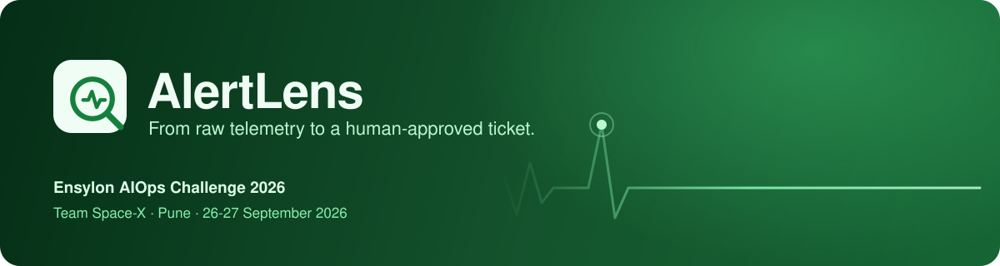
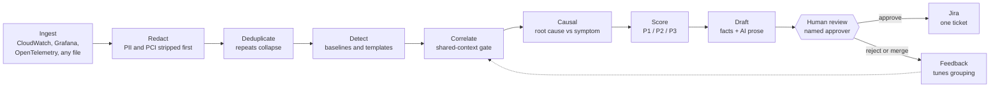

<div align="center">



<br/>

[](https://python.org)
[](https://fastapi.tiangolo.com)
[](https://nextjs.org)
[](#testing)
[](#guarantees)

**An AIOps system that turns a storm of alerts into one explained incident,<br/>and never publishes a ticket without a named human saying yes.**

[The 90-second story](#the-90-second-story) ·
[Pipeline](#the-pipeline) ·
[Guarantees](#guarantees) ·
[Honest status](#honest-status-real-vs-mock) ·
[Run it](#run-it) ·
[API](#api-reference)

</div>

<br/>

## Why AlertLens

On-call engineers do not lack alerts; they lack *an answer*. A single failing database can raise hundreds
of alarms across a dozen services, and someone has to work out that they are one incident, find the actual
cause, decide how bad it is, and write it up, at 3 a.m., under pressure.

AlertLens does that work and shows its reasoning at every step:

- **Groups** related signals into one incident, and never groups on time alone.
- **Finds the root cause**, not the loudest symptom, and proves the symptoms are symptoms.
- **Scores severity** from four visible, weighted factors, with no black box.
- **Drafts the ticket** with computed facts and AI prose kept visibly separate.
- **Waits for a human.** Nothing reaches Jira until a named reviewer approves it.

Built by **Team Space-X** for the **Ensylon AIOps Challenge 2026**.

## At a glance

| | |
|---|---|
| **Golden incident** | 18 signals from four sources become **1 incident**; a decoy alarm in the same minute is **rejected** |
| **Root cause** | `postgres-primary` (93% confidence); three downstream services ruled out by a counterfactual check |
| **Severity** | **P1 = 0.846**, from blast radius, business criticality, trend and signal diversity |
| **Generalisation** | Root cause right in **97%** of 80 held-out generated runs; grouping F1 0.81 when incidents are staggered |
| **Scale** | The full 9,695-row Loghub BGL file runs through the engine in about 11 s |
| **Auto-published tickets** | **0**, by construction (see [Guarantees](#guarantees)) |
| **Tests** | 365 backend · 330 frontend, run on every push by CI |

## The pipeline



| Stage | What it does |
|---|---|
| **Redact** | Regex (plus optional Presidio NER) removes PII/PCI *before* dedup, storage or any LLM call |
| **Deduplicate** | Fingerprints repeated firings, e.g. 12 identical "connection pool exhausted" errors become 1 signal |
| **Detect** | EWMA baselines and z-scores for metrics; Drain3 template mining for logs; trusts pre-flagged alarms |
| **Correlate** | Groups signals only when they share a service, a dependency edge, or a trace id |
| **Causal** | Ranks candidates by precedence and reach, then removes each in turn to see what is still explained |
| **Score** | Weighted composite (blast radius, criticality, trend, diversity) with maintenance-window and flap handling |
| **Draft** | Jira-ready ticket; computed facts and generated narrative are visibly separated |
| **Review** | Approve, edit, reject or merge, each recorded with the reviewer's name |

## The 90-second story

Click **Inject failure** on the Overview. A fixed, deterministic failure runs through the real engine:

| Step | What you see |
|---|---|
| Ingest | 18 signals from CloudWatch metrics and logs, Grafana, and OpenTelemetry traces |
| Deduplicate | 12 identical "connection pool exhausted" errors collapse into 1 signal |
| Correlate | 17 signals become **1 incident**; an unrelated disk-usage alarm in the same minute is **rejected** |
| Explain | Per signal: which shared-context link joined it, its similarity score, and what was rejected and why |
| Root cause | `postgres-primary` (0.89), not the loudest symptom; downstream services ruled out by a counterfactual check |
| Score | P1 = 0.846 from four visible weighted factors |
| Draft | Computed facts and AI prose shown separately; the LLM cannot add evidence |
| Review | "AWAITING HUMAN REVIEW: Jira not created" until a named person approves |
| Page | The P1 fires a notification the moment it forms (mock transport unless a webhook is configured) |
| Act | Approve → single-use approval token → one (mock) Jira issue |
| Live | A late related alert attaches to the same incident, or becomes a comment on the same Jira issue |
| Context | Resembles seeded past incident INC-0417 (90% similar) and shows how it was resolved; context only, never forces a grouping |

Two more one-click scenarios sit beside it: the same failure inside a declared **maintenance window**
(still drafted, but not escalated as a page) and a **flapping** service (4 threshold crossings become 1 incident
with a flap count).

## Guarantees

The constraints that matter are enforced in code, and each has a test.

| Guarantee | How it is enforced | Test |
|---|---|---|
| **No auto-publish** | `JiraClient.create_issue` requires an `ApprovalToken`, minted only in `ReviewQueue.approve`; tokens are single-use and bound to one draft (`backend/app/engine/review.py`) | `test_engine_review_gate.py`, `test_engine_golden.py` |
| **One Jira write path** | `add_comment` can only extend an issue that already consumed an approval token | `test_engine_lifecycle.py` |
| **No duplicate tickets** | Idempotency key = draft id; a second approve is rejected | `test_engine_lifecycle.py` |
| **Time alone never groups** | Shared-context gate: same service, dependency edge, or common trace (`engine/correlate.py`) | `test_engine_golden.py` |
| **No PII/PCI stored** | Redaction runs first, before dedup, storage or the LLM, in both pipelines (`engine/redaction.py`) | `test_engine_adapters.py`, `test_security.py` |
| **Read-only infrastructure** | Telemetry is only received or parsed; nothing writes to a customer environment | design + adapters |
| **API not open to strangers** | Shared-key auth on every route but `/health`; with no key set the backend serves loopback only, so an unconfigured deployment fails closed (`app/security.py`) | `test_security.py` |
| **A bad request is not destructive** | `/ingest` is validated *before* the pipeline clears the alerts table | `test_security.py` |

## Measured, not asserted

Every number below is scored against an answer key the system never reads. Three measurements, deliberately kept apart:

**1. The engine, on held-out estates** (`GET /engine/benchmark`, Evaluation page). The real engine runs on generated estates
that vary topology, telemetry, incident count, noise and timing. Its thresholds were tuned on seeds 1-20; these are seeds 21-40.

| Scenario | Signals | Grouping F1 | Precision | Recall | Root cause | Median time |
|---|---|---|---|---|---|---|
| 3 incidents, staggered | ~82 | 0.81 | 0.87 | 0.79 | 54/54 (100%) | 12 ms |
| 3 incidents, concurrent | ~82 | 0.59 | 0.48 | 0.85 | 37/39 (95%) | 13 ms |
| 6 incidents, staggered | ~203 | 0.71 | 0.61 | 0.89 | 104/107 (97%) | 26 ms |
| 6 incidents, concurrent | ~203 | 0.51 | 0.38 | 0.85 | 61/64 (95%) | 32 ms |

**Root cause is right 97% of the time across all 80 runs.** Grouping is strong when incidents are staggered and weaker when
they are concurrent, which is the known limitation below.

**2. The golden incident** is one hand-written scenario, so its perfect scores (15 of 15 pairs) are a **reproduction check,
not an accuracy estimate**. The UI labels it that way next to the numbers.

**3. The baseline scale explorer.** The Overview, Incidents, Correlations and Topology pages run on a simpler baseline
pipeline built for large datasets: DBSCAN over alert text and time, without the engine's gate, causal step or review gate.
On its own generator across 8 seeds it scores 91.7% incident detection, 91.4% cluster purity and 91.5% noise excluded.
Those numbers describe the baseline, not the engine, and the two generators differ, so they are not directly comparable.

### Known limitation: concurrent incidents

When two unrelated failures hit the same service, or two directly connected services, in the same minute, both pass the
shared-context gate and can be drafted as one incident. Precision drops while recall and root cause hold up. The causal
split recovers some of these. A sweep of its threshold and the clustering radius (18 settings, tuned on seeds 1-20 and
checked on 21-40) found nothing better than the current values, so the fix is structural rather than a tuning change:
weigh error-type evidence more heavily when incidents overlap in time. Meanwhile the human review gate is the backstop,
because a reviewer can split a merged draft with **Merge** or **Reject** before anything reaches Jira.

### Scale

The engine takes the full 9,695-row Loghub BGL file through `/engine/ingest/generic` in about 11 seconds on a laptop
(1,204 unique signals, 41 incidents, 26 MB peak). Redaction is about two thirds of that time.

## Honest status: real vs mock

| Piece | Status |
|---|---|
| Correlation, causal ranking, severity, drafting, review gate, lifecycle | **Real, tested code** |
| CloudWatch / Grafana / OTel parsers and push endpoints (`/engine/ingest/*`) | **Real parsers**, fed by generated payloads |
| `/engine/ingest/generic` (fallback for any alert export in another shape) | **Real**, field-name best-effort matching |
| Live CloudWatch polling with a read-only IAM role | Not connected (needs AWS credentials) |
| Jira | **Mock transport** behind the real client interface; a swap needs URL, email, API token and project key |
| P1 paging | **Real** (fires on every new or escalated P1); **mock transport** until `ALERT_WEBHOOK_URL` is set |
| LLM narrative | Deterministic template fallback; the grounded LLM path needs a provider key |
| Historical matches | Seeded demo history (5 illustrative past incidents), not real tickets |
| Counterfactual check | Rule-based graph ablation, not a trained causal model |
| Reviewer feedback | Rule-based nudge to similarity weights for that service pattern; visible and resettable |
| API authentication | A shared key, per-client rate limits and body caps. It is not a user directory: the reviewer is a name typed into a form, so the audit log records *who claimed* the approval, not a verified identity |
| State | The engine run is rebuilt after a restart by replaying an event log in SQLite; audit timestamps become the replay time. On a host with no persistent disk, `ALERTLENS_AUTOSEED_GOLDEN=1` re-creates the demo run on startup instead |

The Settings page shows the same live-versus-mock status for the running instance, straight from `/engine/health`.

## Run it

```bash
# backend (Python 3.10+)
cd backend
pip install -r requirements.txt
python -m uvicorn app.main:app --port 8001

# frontend (Node 20+), in a second terminal
cd frontend-next
npm install
# .env.local:  API_URL=http://127.0.0.1:8001   AUTH_TYPE=NO_AUTH   NEXTAUTH_SECRET=<any random string>
npm run dev -- -p 3001
```

Open <http://localhost:3001> and click **Inject failure**. For scale, click **Loghub BGL** on the same page.

Nothing else is needed locally: with no `ALERTLENS_API_KEY` set the backend serves the loopback interface only and refuses
remote callers. Deploying anywhere reachable needs a key on both sides; see [`docs/DEPLOY.md`](docs/DEPLOY.md).

## A tour of the UI

| Page | Purpose |
|---|---|
| **Overview** | Headline KPIs for the loaded dataset, or the live engine run, switched explicitly so the two are never mixed |
| **Alert Feed** | Every ingested alert with facet filters |
| **Incidents** | Correlated incidents with root cause, blast radius, playbook and ticket draft |
| **Review Queue** | Human approval gate, audit log, and the investigation view (correlation explorer, root-cause candidates, severity breakdown) |
| **Time Machine** | Compares a live incident with its closest historical match |
| **Correlations · Deduplication** | The chaos-to-order animation and the fingerprint collapse table |
| **Service Topology** | Dependency graph inferred from correlated incidents |
| **Forecast** | Blast-radius prediction, cross-checked against the services actually seen |
| **Maintenance** | Time windows that suppress escalation for a service |
| **Evaluation · Pipeline** | Measured accuracy, and every stage's algorithm and parameters |
| **Settings** | Real system status, including engine health and mock-vs-live integrations |

## Built to adapt to any input

Real telemetry rarely arrives in the shape you assumed. Ingestion is a thin adapter layer, so the engine downstream does not care
whether a signal came from a webhook or a file.

| Endpoint | Accepts |
|---|---|
| `POST /engine/ingest/cloudwatch/alarm` | CloudWatch alarm state change (SNS) |
| `POST /engine/ingest/grafana` | Grafana unified-alerting webhook |
| `POST /engine/ingest/otel/logs` · `/otel/traces` | OTLP/JSON logs and traces (spans also teach the dependency graph) |
| `POST /engine/ingest/generic` | **Any** list of alert-shaped records: matches common field names for service, severity, timestamp and message |

Malformed records are skipped, never fatal, and a payload that yields no signals is reported as such instead of silently succeeding.

To rehearse with a file, `backend/scripts/feed_file.py` reads JSON, JSON Lines or CSV and either runs the engine in-process
(`--local`, any size) or posts it to the running backend with `?fresh=true` so the result appears in the Review Queue.

## API reference

All engine routes live under `/engine`. Every route except `/health` requires `X-API-Key` unless called from loopback with no key configured.

| Method | Route | Purpose |
|---|---|---|
| `POST` | `/golden` · `/scenario/{name}` | Run the golden, `maintenance` or `flapping` scenario |
| `POST` | `/demo/run` | Generate and run a random fault-injected scenario |
| `GET` | `/queue` · `/queue/{id}` | Drafts awaiting or past review; one full ticket |
| `GET` | `/queue/{id}/evidence` | Why this incident: joins, exclusions, root-cause candidates, severity |
| `POST` | `/queue/{id}/approve` · `/reject` · `/merge` | The review gate (each needs a named `actor`) |
| `POST` | `/queue/{id}/late-signal` · `/resolve` | Live attach to an open incident; close it |
| `GET` | `/report` · `/audit` · `/feedback` | Last run's stats and measured evaluation; audit log; learned corrections |
| `GET` | `/health` | Queue depth, per-stage latency, and which integrations are live or mock |
| `GET` | `/benchmark` | The engine scored on held-out generated estates (cached after the first call) |
| `POST` | `/ingest/*` | See [Built to adapt](#built-to-adapt-to-any-input) |

## Configuration

Every variable is optional; see [`.env.example`](.env.example).

| Variable | Effect |
|---|---|
| `ALERTLENS_API_KEY` | Shared API key. Required for any network-reachable deployment; set the same value in the frontend |
| `ALERT_WEBHOOK_URL` | Pages this URL (Slack, PagerDuty, any JSON POST endpoint) when a P1 forms |
| `CEREBRAS_API_KEY` · `GROQ_API_KEY` | Enables grounded LLM narratives; without one, drafts use the deterministic template |
| `ALERTLENS_AUTOSEED_GOLDEN` | Set to `1` to re-run the golden scenario on startup when there is no event log to restore (for hosts without a persistent disk) |
| `ALERTLENS_ALLOWED_ORIGINS` | Browser origins allowed to call the API cross-origin |
| `ALERTLENS_RATE_LIMIT` · `ALERTLENS_EXPENSIVE_RATE_LIMIT` · `ALERTLENS_MAX_BODY_BYTES` | Request limits |

## Testing

```bash
cd backend && python -m pytest -q          # 365 tests
cd frontend-next && npx jest               # 330 tests
```

GitHub Actions ([`.github/workflows/ci.yml`](.github/workflows/ci.yml)) runs both suites plus a production build (type-check and lint included) on every push and pull request.

## Repository layout

```
backend/app/engine/         the pipeline: adapters, redaction, dedup, detect, correlate, causal, severity,
                            drafting, review gate, notifications, lifecycle, feedback, evidence, scenarios
backend/app/engine_api.py   HTTP surface for the engine (/engine/*)
backend/app/security.py     auth, rate limits and size caps: the whole trust boundary in one file
backend/app/                the dataset pipeline behind the BGL / synthetic scale demo
frontend-next/              Next.js 15 UI (Tremor, Tailwind, SWR)
data/                       synthetic generator and the Loghub BGL sample
docs/                       demo script, deployment notes, brand assets
render.yaml                 backend deployment blueprint
```

## Deploying

Two processes: the FastAPI backend (which holds the engine) and the Next.js frontend. The backend deploys from
[`render.yaml`](render.yaml); the frontend deploys to Vercel. Full steps, including the shared key, are in [`docs/DEPLOY.md`](docs/DEPLOY.md);
the click path for a demo is in [`docs/DEMO_SCRIPT.md`](docs/DEMO_SCRIPT.md).

<br/>

<div align="center">

**Team Space-X** · Ensylon AIOps Challenge 2026

<sub>Less noise. Faster answers. Happier on-calls.</sub>

</div>
