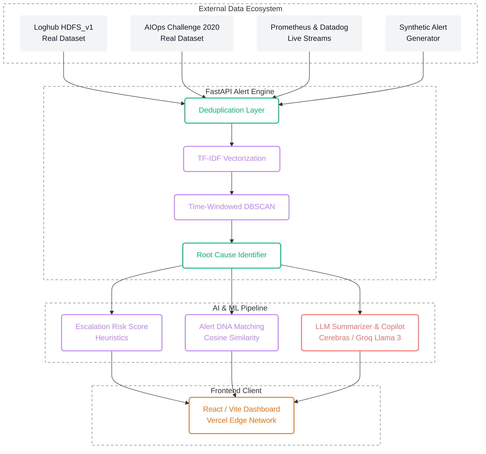

<div align="center">
  <h1>🚨 Alert Correlation & Dedup Engine</h1>
  <p><strong>Synergy 2026 · HPE Problem Statement #10</strong></p>
  <p>Turning infrastructure noise into actionable, prioritized intelligence.</p>
</div>

<br />

## 🌩️ The Problem: Alert Storms

In modern microservice architectures, **one single infrastructure failure triggers hundreds of downstream alerts within minutes.**

Engineers spend the critical first 15 minutes of a major incident simply sifting through the noise, trying to figure out what actually broke. Existing systems rely on static rules that are hard to maintain and fail when novel incidents occur.

## 💡 The Solution: Intelligent Alert Correlation

This engine doesn't just silence alerts; it collapses the flood into a handful of **actionable incidents**. We go two steps further than traditional correlation tools:

1. 📈 **Escalation Risk Score:** A real-time, explainable signal identifying which incident cluster is trending toward a larger failure based on alert growth rate, severity trend, and service spread. Correlation tells you what broke; this tells you what to look at _first_.
2. 🧬 **Alert DNA:** Every new incident cluster is fingerprint-matched against a library of past incidents. If it resembles something seen before, the previous resolution is surfaced automatically: _"87% similar to INC-0412 — restarting the connection pool fixed it in 12 min."_
3. 🤖 **AI Copilot (Cerebras):** Each incident is automatically summarized in plain English by an LLM, and an interactive chat copilot allows engineers to query the incident graph directly.

> **TL;DR:** Correlation tells you what broke. We tell you what's about to break worse — and how it was fixed last time.

---

## 🏗️ System Architecture

Our solution is built on a scalable, modern architecture decoupling data generation, stream processing, and frontend visualization.



### ⚙️ Core Pipeline Stages

| Stage | Implementation Details | Location |
|---|---|---|
| **1. Ingestion & Generation** | Three switchable sources feed the same pipeline: (a) **Loghub HDFS_v1** — real alerts built from actual log lines whose block-level Normal/Anomaly label is the dataset's own human annotation; (b) **AIOps Challenge 2020** — real alerts built from the dataset's fault-injection log; (c) a multi-source synthetic alert generator simulating cascading incident scenarios + background noise. Switch between them via the **Dataset** dropdown in the TopBar. | `data/loghub_hdfs_loader.py`, `data/aiops_challenge_loader.py`, `backend/app/real_data.py`, `backend/app/real_data_aiops.py`, `data/synthetic_alert_generator.py` |
| **2. Deduplication** | Fingerprint hashing of `(service, alertname, 5-min window)` to filter redundant spikes (Alertmanager-style). | `backend/app/dedup.py` |
| **3. Embedding & Correlation** | Utilizes **TF-IDF vectorization + cosine similarity** for semantic matching. Clustered via DBSCAN (parameters grid-searched against ground truth). This lightweight approach replaces heavy transformer models, ensuring blazingly fast execution and low memory footprint. | `backend/app/clustering.py` |
| **4. Root Cause Analysis** | Identifies the earliest alert in a cluster, operating on the principle that failures propagate forward in time. | `backend/app/clustering.py` |
| **5. Escalation Risk Score** | Heuristic formula: `0.40·growth + 0.35·severity + 0.25·spread`. Fully normalized (0-1) and explainable. | `backend/app/risk_score.py` |
| **6. Alert DNA Matching** | Computes cosine similarity between cluster centroids and past incident TF-IDF vectors to surface resolutions for novel-but-similar issues. | `backend/app/alert_dna.py` |
| **7. LLM Summarization** | Translates complex, multi-service clusters into plain English incident summaries and powers the interactive AI Copilot (using **Cerebras / Llama-3.3-70b**). | `backend/app/summarizer.py`, `backend/app/assistant.py` |

---

## 🛠️ Technology Stack

**Backend & Data Science**

- **Python 3 & FastAPI:** High-performance async API server.
- **Scikit-Learn:** TF-IDF Vectorization and DBSCAN clustering algorithm.
- **Pandas & NumPy:** Fast vector operations and data manipulation.
- **Cerebras API:** Blazing fast Llama-3.3-70b inference for the AI Copilot and Incident Summarizer.

**Frontend UI**

- **React 19 & Vite:** Blazing fast modern frontend framework.
- **TailwindCSS 4:** Utility-first styling for a sleek, dark-mode focused UI.
- **React Flow / Dagre:** Interactive, dynamic Service Topology incident graphs.
- **Framer Motion:** Micro-animations and layout transitions.

---

## 🚀 Getting Started

### Prerequisites

- Python 3.9+
- Node.js 18+ & npm/pnpm
- Cerebras API Key (optional, for AI features)

### 1. Backend Setup

```bash
# Install backend dependencies
pip install -r backend/requirements.txt

# Create a .env file and add your Cerebras API key (Optional but recommended)
echo "CEREBRAS_API_KEY=your_key_here" > .env

# One-time: build the real Loghub HDFS_v1 alert batch (downloads + caches
# HDFS_v1.zip from Zenodo, ~187MB, then writes data/loghub_hdfs_alerts.json)
python data/loghub_hdfs_loader.py

# One-time: build the real AIOps Challenge 2020 alert batch (reads only the
# real fault-injection CSV out of a 2.9GB archive via HTTP range requests)
python data/aiops_challenge_loader.py

# Start the FastAPI server
uvicorn app.main:app --app-dir backend --reload
```

_API will be available at http://localhost:8000_

### 2. Frontend Setup

```bash
# Navigate to the frontend directory
cd frontend

# Install dependencies
npm install

# Start the Vite development server
npm run dev
```

_Dashboard will be available at http://localhost:5180_

### 3. Production Deployment

The application is architected for zero-cost deployment on modern PaaS platforms:

- **Frontend (Vercel):** Connect the GitHub repository and deploy the `frontend/` directory using the Vite preset. API requests are automatically proxied to the backend via `vercel.json` rewrites to avoid CORS issues.
- **Backend (Render):** Deploy the repository as a Python Web Service on Render's Free Tier. The pipeline's use of TF-IDF (instead of heavy neural networks) ensures the entire backend runs comfortably within Render's 512MB memory limit. Set the `CEREBRAS_API_KEY` environment variable in Render's dashboard.

---

## 🗺️ Roadmap & Future Scope

- [x] Synthetic multi-source alert generator with ground-truth labels
- [x] Fingerprint deduplication layer
- [x] Embedding + time-windowed DBSCAN correlation (TF-IDF tuned)
- [x] Escalation Risk Score (explainable heuristic)
- [x] Alert DNA past-incident matching
- [x] FastAPI ingestion & pipeline endpoints
- [x] **Frontend:** Full integration of the React Dashboard (Feed, Deduplication, Correlations, Incidents, Service Topology)
- [x] **LLM Integration:** AI Copilot and Incident Summaries powered by Cerebras (Llama-3.3-70b).
- [x] **Real AIOps Datasets:** Both of PS10's named data sources wired end-to-end through the same pipeline, switchable live via the top-bar Dataset selector.
- [ ] **MTTR Estimation:** Feature to estimate "triage time saved" per resolved incident

<br/>
<div align="center">
  <i>Built for Synergy 2026</i>
</div>
